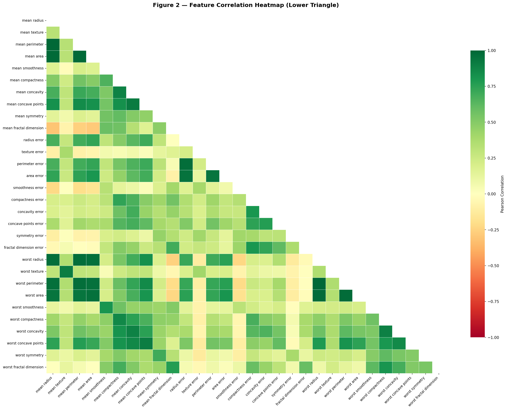
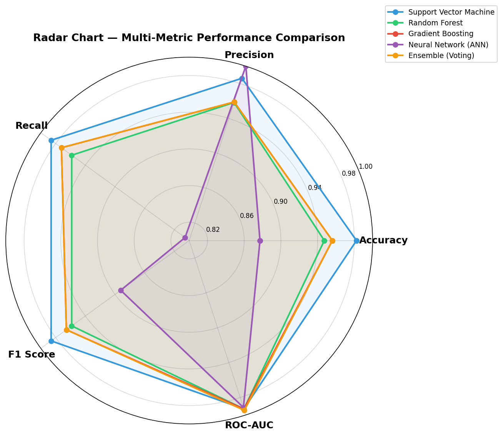

<div align="center">

# 🔬 Breast Cancer Classification

### ML-Powered Interactive Cancer Diagnosis System

[](https://python.org)
[](https://scikit-learn.org)
[](https://flask.palletsprojects.com)
[](https://huggingface.co/spaces/AlphaCalculus/cancer-classification-api)
[](https://vercel-frontend-three-blue.vercel.app)
[](LICENSE)

**An end-to-end machine learning project that classifies breast tumors as Benign or Malignant using cell-nuclei features from the Wisconsin Breast Cancer Dataset, deployed as a full-stack web application.**

[Live Demo](https://cancer-classification.vercel.app/) · [API](https://alphacalculus-cancer-classification-api.hf.space)

</div>

---

## 📸 Screenshots

<div align="center">
  
  
</div>

---

## 🏗️ Architecture

```
┌─────────────────────────────────────────────────────────────────┐
│                          USER BROWSER                           │
│              Vercel Frontend (Static HTML + JS)                 │
│         Sliders for 30 features → Radar chart + Result          │
└───────────────────────────┬─────────────────────────────────────┘
                            │  REST API (JSON)
                            ▼
┌─────────────────────────────────────────────────────────────────┐
│                    Hugging Face Spaces Backend                  │
│                  Flask + Gunicorn (Docker)                      │
│                                                                 │
│   /features  → returns feature metadata + selection mask        │
│   /predict   → 30 values → SelectKBest → Scaler → SVM → label   │
└─────────────────────────────────────────────────────────────────┘
```

---

## 📊 Model Performance

| Model | Accuracy | Precision | Recall | F1 Score | ROC-AUC | CV Mean ± Std |
|-------|----------|-----------|--------|----------|---------|---------------|
| **SVM (Best)** | **98.25%** | **98.61%** | **98.61%** | **98.61%** | **99.31%** | **97.14 ± 0.54%** |
| Random Forest | 94.74% | 95.83% | 95.83% | 95.83% | 99.31% | 96.04 ± 1.49% |
| Gradient Boosting | 95.61% | 95.89% | 97.22% | 96.55% | 99.31% | 95.82 ± 1.28% |
| Neural Network | 87.72% | 100.0% | 80.56% | 89.23% | 99.14% | 95.38 ± 2.01% |
| Ensemble (Voting) | 95.61% | 95.89% | 97.22% | 96.55% | 99.47% | 97.36 ± 1.64% |

**Pipeline:** 30 raw features → SelectKBest (k=20) → StandardScaler → SVM (RBF Kernel)

---

## 🗂️ Project Structure

```
cancer_detection/
├── 📓 Cancer_Classification_MLC2_Project.ipynb   # Full EDA + training notebook
├── 🐍 app.py                                     # Local Flask UI (dev/testing)
├── 📄 .env.example                                # Environment variable template
├── 📄 .gitignore                                  # Git ignore rules
├── 📄 LICENSE                                     # MIT License
│
├── hf-backend/                     # ☁️  Hugging Face Spaces (API)
│   ├── app.py                      #     Flask API server
│   ├── Dockerfile                  #     Container config
│   ├── requirements.txt            #     Python dependencies
│   ├── README.md                   #     HF Spaces metadata
│   └── models/                     #     Serialized model artifacts
│       ├── best_model.pkl          #         SVM classifier
│       ├── scaler.pkl              #         StandardScaler
│       └── selector.pkl            #         SelectKBest selector
│
├── vercel-frontend/                # 🌐 Vercel (Static Frontend)
│   ├── index.html                  #     Interactive UI with Chart.js
│   └── vercel.json                 #     Vercel routing config
│
├── templates/                      # 🖥️  Local Flask templates
│   └── index.html                  #     Local UI template (Jinja2)
│
└── outputs/                        # 📈 Training outputs
    ├── models/                     #     Trained model files
    │   ├── best_model.pkl
    │   ├── scaler.pkl
    │   └── selector.pkl
    ├── plots/                      #     Visualization outputs
    │   ├── 01_class_distribution.png
    │   ├── 02_correlation_heatmap.png
    │   ├── 03_feature_distributions.png
    │   ├── 04_model_comparison.png
    │   ├── 05_confusion_matrices.png
    │   ├── 06_roc_curves.png
    │   ├── 07_feature_importance.png
    │   ├── 08_cross_validation.png
    │   └── 09_radar_chart.png
    └── reports/                    #     CSV reports
        ├── dataset_summary.csv
        └── model_results.csv
```

---

## 🚀 Quick Start

### Prerequisites

- Python 3.10+
- pip

### 1. Clone the Repository

```bash
git clone https://github.com/<your-username>/cancer-classification.git
cd cancer-classification
```

### 2. Install Dependencies

```bash
pip install flask scikit-learn joblib numpy
```

### 3. Run Locally

```bash
python app.py
```

Open [http://127.0.0.1:5000](http://127.0.0.1:5000) in your browser.

### 4. Environment Variables (for deployment)

```bash
cp .env.example .env
# Edit .env with your actual values
```

---

## ☁️ Deployment

### Backend → Hugging Face Spaces

The `hf-backend/` directory is deployed as a **Docker Space** on Hugging Face:

1. Create a new Space on [huggingface.co](https://huggingface.co/new-space) with SDK = **Docker**
2. Push the `hf-backend/` contents to the Space repo
3. The API auto-deploys at `https://<your-space>.hf.space`

### Frontend → Vercel

The `vercel-frontend/` directory is deployed as a **Static Site** on Vercel:

1. Import the `vercel-frontend/` folder on [vercel.com](https://vercel.com)
2. Deploy — the frontend auto-connects to the HF backend API

---

## 📓 Notebook

The full analysis pipeline is in `Cancer_Classification_MLC2_Project.ipynb`:

1. **Data Loading** — Wisconsin Breast Cancer Dataset (569 samples, 30 features)
2. **EDA** — Class distribution, correlation heatmap, feature distributions
3. **Preprocessing** — SelectKBest (k=20), StandardScaler
4. **Model Training** — SVM, Random Forest, Gradient Boosting, Neural Network, Voting Ensemble
5. **Evaluation** — Confusion matrices, ROC curves, cross-validation
6. **Model Export** — Serialized to `.pkl` for deployment

---

## 🧬 Dataset

**Wisconsin Breast Cancer Dataset** (via `sklearn.datasets.load_breast_cancer`)

- **569** samples | **30** features | **2** classes (Malignant / Benign)
- Features computed from digitized FNA images of breast masses
- 10 real-valued features × 3 statistics (mean, std error, worst)

---

## 🛠️ Tech Stack

| Layer | Technology |
|-------|-----------|
| **ML Framework** | scikit-learn 1.6 |
| **Backend** | Flask 3.1 + Gunicorn |
| **Frontend** | Vanilla HTML/CSS/JS + Chart.js |
| **Backend Hosting** | Hugging Face Spaces (Docker) |
| **Frontend Hosting** | Vercel |
| **Containerization** | Docker |

---

## 🤝 Contributing

Contributions are welcome! Please see [CONTRIBUTING.md](CONTRIBUTING.md) for guidelines.

---

## 📄 License

This project is licensed under the MIT License — see the [LICENSE](LICENSE) file for details.

---
